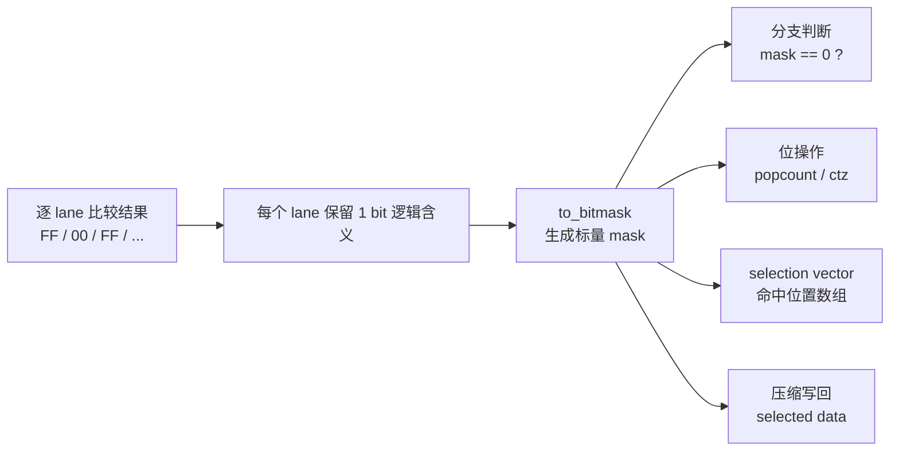

# `to_bitmask` 深度拆解：X86/ARM 实现差异、ARM 默认实现与 ARM 演进方向

## 摘要

`to_bitmask` 这个名字很容易让人先想到 bitmap，但在向量化代码里，它通常只是在做一件更窄、也更“脏活”的事：**把逐 lane 的布尔结果压成一个短小的标量控制字**。  
动作本身不大，位置却很要命。过滤、selection vector（命中位置数组）、Null 处理、压缩写回，这些地方往往不是比较本身慢，而是比较完以后，结果要怎么交给下一步。

所以这篇文档按两步来写。前半部分先把 `to_bitmask` 自己讲清楚：它到底是什么，x86 为什么做得顺手，ARM 现在有哪些等价实现。后半部分再把视角换到消费侧：同样一份比较结果，`count`、`first hit`、selection vector（命中位置数组）、selected data 这些后续动作各自该怎么接，哪些场景根本不该先绕回标量 mask。

## 1. 问题卡在什么地方

很多向量化内核真正慢的，不是比较本身，而是比较完之后那一下“结果转交”。在寄存器里，结果是每个 lane 各自一份布尔状态；到了下游，控制逻辑往往要的却是一个能拿来 `test`、`popcount`、`ctz`、驱动 selection vector（命中位置数组）或压缩写回的标量控制字。`to_bitmask` 处理的正是这一段。

它之所以经常卡在热路径上，原因也不复杂。它几乎出现在每个向量批次里，而且天然带着跨 lane 聚合；一旦做不好，就会把原本还能留在向量域里的流水线，硬拖回标量域。数据库执行引擎、列式扫描、SIMD filter、字符串扫描、Null bitmap 处理这些代码，对这种“看起来不大、实际上总要走”的步骤都很敏感。

## 2. 先把语义说清楚

### 2.1 语义定义

本文统一把 `to_bitmask` 定义为：

> 把 `N` 个 lane 的布尔/比较结果压缩成一个 `N` bit 的标量 mask。

输入可能是 `0x00/0xFF` 这类字节谓词，也可能是更宽元素上的全 0 / 全 1 比较结果，或者 ISA 原生的 predicate / mask 对象。输出则是一个普通标量，约定第 `i` 位表示第 `i` 个 lane 是否命中。后续不管是 `if (mask == 0)`、`popcount(mask)`、`ctz(mask)`，还是 selection vector（命中位置数组）生成，靠的都是这份标量控制信息。

### 2.2 它不是什么

它不是泛指“构造 bitmap”。把一批行的逻辑状态持久化到 bitmap 缓冲区，和把一个 SIMD 寄存器里的比较结果压成临时标量 mask，是两件事。前者更像存储格式，后者是执行路径里的中间动作。本文只讨论后者。

### 2.3 最小例子

假设有 8 个 lane 的比较结果：

| lane | 7 | 6 | 5 | 4 | 3 | 2 | 1 | 0 |
| --- | --- | --- | --- | --- | --- | --- | --- | --- |
| value | 0 | 1 | 0 | 0 | 1 | 1 | 0 | 1 |

那么输出 bitmask 就是 `0b01001101`。  
如果写成最直白的伪代码，本质上就是“第 `i` 个 lane 的真假结果，对应 mask 的第 `i` 位”。

### 2.4 语义示意图

把它画成一条最短的数据流，大概就是下面这样：



如果只看本文关心的边界，`to_bitmask` 处理的就是中间这一步：**把一批 lane 的真假结果，交成后续控制逻辑能直接消费的标量 mask。**

## 3. 它通常出现在哪里

### 3.1 向量化过滤

最典型的场景还是 filter：

`pred = (col > threshold)` 之后，紧接着就是 `mask = to_bitmask(pred)`。

真正麻烦的部分不在那句比较，而在 `mask` 出来以后。当前批次是不是全空、命中个数有多少、第一个命中在哪、要不要生成 selection vector（命中位置数组），这些决定都压在它上面。

### 3.2 比较结果快速归约

很多逻辑根本不关心每个 lane 的最终落点，它只想知道是否存在命中、是否全部命中、第一个命中在哪里，或者命中总数有多少。x86 上大家很自然会把 bitmask 当中间表示；ARM 上这一步是否值得做，就没那么理所当然了。

### 3.3 Null/validity 处理

列式系统里经常需要把一批值的有效性合并成控制信息，这类路径看起来不像 filter 那么“显眼”，但对 `to_bitmask` 的依赖一点也不小。

### 3.4 字符串和模式扫描

对一段字节做等值、范围或分类判断后，后续经常要立刻定位命中位置。x86 里这类代码几乎天然围着 `movemask` 转，ARM 上也正是在这类场景里，最容易暴露“先做 mask”到底是不是最优前提。

## 4. x86 为什么写起来顺手

### 4.1 `movemask` 把这件事做成了原语

x86 最大的优势不是“SIMD 更强”，而是它把这件事定义成了直接原语。

在 `SSE2/AVX2` 时代，典型做法是：

- 比较得到每 byte lane 的 `0x00/0xFF`
- 用 `PMOVMSKB / VPMOVMSKB`
- 直接抽取每个 byte 的最高位，拼成标量 mask

这正好与 byte 粒度布尔结果天然匹配。

### 4.2 `SSE/AVX2` 这条路几乎没有绕路

示意上就是两步：

- `__m128i pred = _mm_cmpeq_epi8(a, b)`，然后 `_mm_movemask_epi8(pred)`
- 或者 `__m256i pred = _mm256_cmpeq_epi8(a, b)`，然后 `_mm256_movemask_epi8(pred)`

这个模型的优势很直接：

- 语义就是“取每个 byte 的 sign bit”
- 指令链非常短
- 不需要手工做跨 lane 压缩
- 编译器与工程师对这条路径都很熟

### 4.3 `AVX-512` 里 mask 已经成了执行域的一部分

到了 `AVX-512`，很多比较根本不再先产出“全 0 / 全 1 的向量”，而是直接产出 mask 寄存器。

示意上就是 `_mm512_cmpeq_epi8_mask(a, b)` 这种“比较直接产出 mask”的形式。

这意味着在很多场景里，`to_bitmask` 甚至不再是一个单独步骤。  
比较的结果天然就是 mask。

### 4.4 x86 占便宜的地方

所以 x86 的优势不只是“有一条 `movemask` 指令”。更准确地说，是 ISA 从一开始就承认“向量布尔结果最终会被当成控制信息消费”，并且给了非常短的导出路径。到了 `AVX-512`，连这一步导出本身都在弱化，因为 mask 已经成了执行域的一部分。

### 4.5 x86 指令路径演进表

| 平台 | 典型输入 | 典型路径 | 标量化成本 | 工程结论 |
| --- | --- | --- | --- | --- |
| x86 SSE2 | byte compare 结果 | `cmp -> pmovmskb` | 低 | `movemask` 已经把问题定义成硬件原语 |
| x86 AVX2 | 32 x byte compare 结果 | `cmp -> vpmovmskb` | 低 | 宽度扩大，但模型不变 |
| x86 AVX-512 | compare 直接生成 mask | `cmp -> k-mask` | 更低 | 很多路径里 `to_bitmask` 甚至不再单独出现 |

## 5. ARM 侧几条 `to_bitmask` 实现路线

### 5.1 ARM 上为什么总要多绕几步

ARM 难做的地方并不是“SIMD 不够强”，而是问题定义本来就和 x86 不一样。x86 把“从向量布尔结果导出标量控制字”做成了硬件原语；ARM 没有一条完全对位的直达路，于是比较结果更自然的落点往往是向量布尔结果或者 predicate，而不是标量 mask。一旦你真的要回到固定宽度控制字，pack、shuffle、reduction，以及把结果转成普通标量数据这件事，都得自己承担。

所以在 ARM 上，`to_bitmask` 更像一个小型压缩内核，而不是“一条顺手的指令”。如果只讨论“怎么把 predicate 或比较结果变成标量 mask”，后面主要看三条路线：

| 路线 | 核心思路 | 适合的问题 |
| --- | --- | --- |
| `NEON` | 在普通向量域内自己完成压位与归约 | 当前最通用、最现实的固定宽度 mask 生成方式 |
| `SVE st-ld p` | 先把 `p` 寄存器 spill 到内存，再加载到普通寄存器 | SVE 环境下最直接的 `p -> scalar` 语义路径 |
| `SVE2.1 PMOV` | 先把 `p` 寄存器搬到 `z` 寄存器，再用 `UMOV` 取到 `x/w` | 支持寄存器内完成 `p -> z -> scalar` 的路径 |

### 5.2 `NEON`：位权压缩加水平归约

#### 5.2.1 常见几种写法

如果只看 `AArch64 + NEON`，主流做法基本都绕不开下面几类：

| 实现族 | 思路 | 优点 | 主要问题 |
| --- | --- | --- | --- |
| 标量抽 lane | 逐个 lane 取值，移位后 OR 到标量 | 直观 | 指令数高，彻底打断向量流水线 |
| `shift/narrow/zip/uzp` 链 | 用窄化和重排逐步压位 | 没有乘法 | 跨 lane 操作多，链路长 |
| `tbl`/查表路径 | 用表驱动收缩布局 | 某些模式下灵活 | 对微架构敏感，维护成本高 |
| 位权压缩 + 水平归约 | 用位权常量选位，再做 `addv` 归约 | 结构简单，编译器更容易生成稳定代码 | 依赖水平归约吞吐 |

#### 5.2.2 一个适合字节谓词的 NEON 核心实现

这条路的想法其实很直接：命中的 lane 保留自己的位权，不命中的 lane 直接清零；低 8 lane 的和就是低 8 bit，高 8 lane 的和就是高 8 bit。只要输入确实是 `0x00/0xFF`，这些位权就不会彼此冲突。

本地用 Clang 21 对 AArch64 目标做 `-O3` 编译时，核心逻辑能比较稳定地落成下面这种短序列：

```asm
AND   v0.16b, v0.16b, v1.16b      ; 命中 lane 保留各自位权，未命中 lane 清零
EXT   v1.16b, v0.16b, v0.16b, #8  ; 把高 8 byte 挪出来，准备单独归约
ADDV  b0, v0.8b                   ; 归约低 8 byte，得到低 8 bit
ADDV  b1, v1.8b                   ; 归约高 8 byte，得到高 8 bit
BFI   w0, w8, #8, #24             ; 把高 8 bit 拼回结果，形成固定宽度 mask
```

这件事很关键，因为它说明这条路不只是“思路上能写通”，而是编译出来也确实比较稳。

#### 5.2.3 为什么今天默认还是它

在当前 ARM 可落地能力下，如果问题非常具体，就是“今天要把 byte 级谓词稳定压成固定宽度 mask”，`NEON 位权压缩 + 水平归约` 仍然是默认答案。原因也不神秘，无非是它同时避开了逐 lane 标量抽取和过长的 `shuffle/narrow` 链，而且编译器也更容易把它编成稳定的短路径。对很多 filter/scan 内核来说，16-byte 粒度本来就够做底层核了。

#### 5.2.4 这条路的边界

它更适合下面这种边界清晰的问题：

- 输入是 byte 粒度的 `0x00/0xFF` 谓词
- 目标是固定宽度标量 mask，而不是可变长度表示
- 更看重代码形态稳定，而不是追求最激进的 ISA 专用写法

更准确地说：**在当前 ARM 可落地能力下，只要目标是把 byte 级布尔结果稳定压成固定宽度 bitmask，这条路线最适合拿来当默认实现。**

### 5.3 `SVE`：先落内存，再取回标量

这条路线不要理解成“有一组现成 ACLE intrinsic 可以直接替代 `movemask`”。它讨论的是一条很直白的语义路径：比较结果先停在 `p` 寄存器里，然后通过一次 store/load 把它变成普通标量寄存器里的 mask。

如果只看 `to_bitmask` 这件事本身，这条路的含义很明确：

- `p` 寄存器是比较结果的自然宿主
- `str` 把 predicate 的低位布局落到内存
- `ldr` 再按目标 mask 宽度取回到 `x/w` 寄存器

代价也很明确：这条路需要内存中转，讨论的是“怎么得到标量 mask”，不是“怎么让后续消费更优”。

汇编级示意如下：

```asm
WHILELT  p0.b, xzr, xN             ; 建立当前批次的有效 lane 掩码
CMPEQ    p1.b, p0/z, z0.b, z1.b    ; 生成比较结果 predicate
STR      p1, [xTmp]                ; 把 predicate 的底层位布局写到内存
LDR      x9, [xTmp]                ; 按目标宽度读回到通用寄存器
```

这里的重点不是某条具体 mnemonic 的语法细节，而是这条语义链：**`p -> memory -> scalar register`**。只要目标是固定宽度 mask，这条路径就说得通。

### 5.4 `SVE2.1`：`PMOV + UMOV` 的寄存器路径

`SVE2.1` 这里关心的也不是更宽的后续输出，而是另一条更纯粹的 `to_bitmask` 路径：先把 `p` 寄存器搬到 `z` 寄存器里，再从向量寄存器的低 lane 取到普通寄存器。

这条路线的核心就是两步：

- `PMOV`：`p -> z`
- `UMOV`：`z -> x/w`

它讨论的是“怎么把 predicate 转成标量 mask”，不是“怎么把多个 chunk 组织给后续逻辑”。汇编级示意如下：

```asm
WHILELT  p0.b, xzr, xN             ; 建立当前批次的有效 lane 掩码
CMPEQ    p1.b, p0/z, z0.b, z1.b    ; 生成比较结果 predicate
PMOV     z4, p1.b                  ; 把 predicate 搬到向量寄存器
UMOV     x9, v4.d[0]               ; 从向量寄存器低 lane 取回标量 mask
```

和 `SVE st-ld p` 相比，这里不再依赖内存中转；和 `NEON` 相比，这条路直接从 predicate 出发。对 `to_bitmask` 本身来说，这就是它最值得单独拎出来分析的地方。

### 5.5 三条实现放在一起看

| 路线 | 核心路径 | 是否寄存器内完成 | 是否需要内存中转 | 对应 FEAT | 工程判断 |
| --- | --- | --- | --- | --- | --- |
| `NEON` | 向量内压位 + 水平归约 | 否 | 否 | `AdvSIMD / NEON` | 今天最现实的默认实现 |
| `SVE st-ld p` | `str p -> ldr x/w` | 否 | 是 | `FEAT_SVE` | 语义直接，但依赖内存中转 |
| `SVE2.1 PMOV` | `PMOV p->z -> UMOV z->x/w` | 是 | 否 | `FEAT_SVE2p1` | 更干净的寄存器路径 |

### 5.6 今天默认怎么选

如果把问题限定得很死：今天、当前 ARM 可落地能力、目标是把 byte 级布尔结果转成固定宽度标量 mask，那么默认实现仍然优先是 **`NEON 位权压缩 + 水平归约`**。

但这个结论只能放在这个前提里看。它说的是“当前 ARM 默认实现”是什么，不等于别的路线没有意义。

- 如果目标平台只要求今天稳定可用，`NEON` 仍然是默认答案
- 如果环境已经是 `SVE`，`str p -> ldr x/w` 是最直接的 `p -> scalar` 语义路径
- 如果平台具备 `FEAT_SVE2p1`，`PMOV + UMOV` 则给了一条更干净的寄存器内生成路径

## 6. 到这里先把“生成 mask”这件事收住

到第 5 章为止，前面只回答了一件事：**如果边界真的要一个固定宽度标量 mask，ARM 该怎么生成它。**

但这还不是大多数热路径真正关心的问题。很多时候，比较结果出来以后，下一步要的并不是一份独立的 bitmask，而是更具体的消费动作：有没有命中、第一处命中在哪、命中位置数组怎么写、命中数据怎么连续写出、多个条件怎么继续组合。

这也是两边在工程写法上的根本差异：

- x86 很容易自然写成 `compare -> movemask -> 后续处理`
- ARM 更像是在做选择题：继续留在 predicate 域，还是退回到固定宽度标量控制字

所以下面不再追着“mask 怎么做”往下讲，而是改成反过来看：**结果接下来怎么用。** 先把消费动作拆开，很多判断自然就会顺下来。只要后续逻辑还能停留在 predicate 或向量域里，就尽量别先生成标量 mask；只有在接口边界、老代码兼容，或者必须进入标量控制流时，才需要专门补一步 `to_scalar_mask`。

## 7. 先看结果怎么用

第 5 章讲的是“必须交出标量 mask 时怎么办”，这一章讲的则是另一件事：**同一份比较结果，后续消费方式不同，最优路径也会完全不同。**

为了把这件事讲直观，先固定一个统一例子。后面所有场景都围着这一个例子展开，这样比较不同 ISA 的写法时，不会老在“输入变了还是策略变了”之间来回跳。

先看一个统一例子。假设当前 8 个 lane 的比较结果是：

| lane | 7 | 6 | 5 | 4 | 3 | 2 | 1 | 0 |
| --- | --- | --- | --- | --- | --- | --- | --- | --- |
| hit | 1 | 0 | 1 | 0 | 0 | 1 | 1 | 0 |

按 `lane 0` 对应最低位来记，对应的标量 `mask` 就是 `0b10100110`。

下面默认 `lane 0` 对应最低位。那同一个 `mask` 往后大概会有这几种用法：

- `any/all/count`：`any = true`，`all = false`，`count = 4`
- `first hit`：第一个命中位置是 `1`
- `all hit positions`：生成 selection vector（命中位置数组）`[1, 2, 5, 7]`
- `selected data`：如果原数据是 `[10, 20, 30, 40, 50, 60, 70, 80]`，那命中数据就是 `[20, 30, 60, 80]`
- `predicate/mask algebra`：还能继续和别的条件做 `and/or/xor`

先把几类最常见的消费方式列出来：

| 场景 | 真正目标 | 是否必须先生成 mask |
| --- | --- | --- |
| `any/all/count` | 快速判断或计数 | 通常不需要 |
| `first hit` | 找第一个命中 | 通常不需要 |
| `all hit positions` | 生成 selection vector（命中位置数组） | 视输出边界而定 |
| `selected data` | 取命中元素或压缩写回 | 通常不需要 |
| `predicate/mask algebra` | 继续组合条件 | 通常不需要 |

顺着这个表往下看，后面的顺序其实也很自然：先讲最轻的判断与计数，再讲定位，再讲位置数组和数据输出，最后讲条件继续组合。这样每往后一节，目标都会比前一节更“重”一点，但主线不变，始终是在回答同一个问题：**结果到底要交给下一步什么形式。**

真正拉开差距的地方，不是“更像 x86 一样把 mask 做出来”，而是“让更多场景压根不用回到 mask”。

如果接口边界就是要一个固定宽度标量 mask，那一类情况第 5 章已经单独讲过，这里不再重复展开。

为了让代码块更直观，下面的写法统一按这个规则处理：

- `A64 base / FEAT_CSSC`：只写“已经退回到标量 mask 之后”的标量尾部
- 其他路径：都从向量比较开始

所以第 7 章里真正不在同一起点上的，只有 `A64 base / FEAT_CSSC` 这两类实现；它们的前面还隐含着一个“先把结果生成为标量 mask”的步骤，这个成本不包含在当前代码块里。

### 7.1 `any/all/count`

这一类是最轻的消费：只要一个布尔结论或一个计数，并不关心具体位置。  
x86 上把它写成 `compare -> movemask -> test/popcnt` 很自然，因为 `movemask` 本来就够便宜；ARM 上如果也这么走，往往只是把 predicate 里现成的答案又绕回了一遍标量。

所以这类场景最适合拿来当分水岭看：x86 的标准路径是 `mask-first`，ARM 更顺的路径则是直接在 predicate 域里回答 `any/all/count`，只有已经退回标量边界的旧代码，才需要 `A64 base` 或 `FEAT_CSSC` 去接最后那一小段尾部。

**x86 / AVX2**

```asm
VPCMPEQB  ymm0, ymm2, ymm3         ; 先做逐 byte 比较，生成 0x00/0xFF 谓词
VPMOVMSKB eax, ymm0                ; 抽取每个 byte 的最高位，生成标量 mask
TEST      eax, eax                 ; 判断是否存在命中
POPCNT    ecx, eax                 ; 统计命中个数
CMP       eax, -1                  ; 判断是否全部命中
```

**x86 / AVX-512**

```asm
VPCMPEQB  k1, zmm2, zmm3           ; 先做逐 byte 比较，直接生成 k-mask
KORTESTQ  k1, k1                   ; 判断是否存在命中
KMOVQ     rax, k1                  ; 把 k-mask 搬到通用寄存器
POPCNT    rcx, rax                 ; 统计命中个数
CMP       rax, -1                  ; 判断是否全部命中
```

**ARM / `A64 base`（已生成标量 mask 后）**

```asm
MOV       x2, x1                   ; x1 里已经是标量 mask，先备份一份给后续步骤
CBNZ      x2, .Lany_true           ; 只要 mask 非 0，any 就为真
MOV       w5, wzr                  ; any=false，结果写成 0
B         .Lcheck_all              ; 跳去继续做 all/count
.Lany_true:                        ; any=true 分支
MOV       w5, #1                   ; any=true，结果写成 1
.Lcheck_all:                       ; 开始检查 all 和 count
CMP       x2, xMaskAll             ; 比较是否与“全 1 mask”一致
CSET      w6, EQ                   ; 相等则 all=true，否则 all=false
MOV       x3, x2                   ; x3 保存待统计的剩余 bit
MOV       x4, xzr                  ; x4 累加 count，先清零
.Lcount:                           ; 标量逐 bit 计数循环
CBZ       x3, .Lcount_done         ; 没有剩余 bit 就结束
AND       x7, x3, #1               ; 取出当前最低位
ADD       x4, x4, x7               ; 把当前 bit 累加到 count
LSR       x3, x3, #1               ; 右移一位，继续处理下一 bit
B         .Lcount                  ; 回到循环头
.Lcount_done:                      ; count 统计结束
```

**ARM / `FEAT_CSSC`（已生成标量 mask 后）**

```asm
MOV       x2, x1                   ; x1 里已经是标量 mask，先备份一份给后续步骤
CBNZ      x2, .Lany_true           ; 只要 mask 非 0，any 就为真
MOV       w5, wzr                  ; any=false，结果写成 0
B         .Lcheck_all              ; 跳去继续做 all/count
.Lany_true:                        ; any=true 分支
MOV       w5, #1                   ; any=true，结果写成 1
.Lcheck_all:                       ; 开始检查 all 和 count
CMP       x2, xMaskAll             ; 比较是否与“全 1 mask”一致
CSET      w6, EQ                   ; 相等则 all=true，否则 all=false
CNT       x4, x2                   ; 直接统计置位个数，得到 count
```

**ARM / `FEAT_SVE`**

```asm
CMPEQ     p1.b, p0/z, z0.b, z1.b   ; 先做逐 lane 比较，生成 predicate
PTEST     p0, p1.b                 ; 判断是否存在 active lane，得到 any
CNTP      x0, p0, p1.b             ; 统计 active lane 个数，得到 count
CNTP      x1, p0, p0.b             ; 统计当前批次总 lane 数
CMP       x0, x1                   ; 比较命中个数和总 lane 数
CSET      w2, EQ                   ; 相等则 all=true，否则 all=false
```

| 平台 | 输入前提 | 最优实现 | 是否先生成 mask | 关键指令/原语 | 对应 FEAT |
| --- | --- | --- | --- | --- | --- |
| x86 `AVX2` | 待比较向量 | `cmp + movemask + test/popcnt` | 是 | `VPCMPEQB`, `VPMOVMSKB`, `TEST`, `POPCNT` | `AVX2` |
| x86 `AVX-512` | 待比较向量 | `cmp + kortest/kmov + popcnt` | `any/all` 否，`count` 常常要转成标量 | `VPCMPEQB`, `KORTEST`, `KMOV`, `POPCNT` | `AVX-512BW`, `AVX-512F` |
| ARM | 标量 mask | 已生成 mask 之后做 `any/all/count` | 是 | `CBNZ`, `CMP`, scalar loop | `A64 base` |
| ARM | 标量 mask | 已生成 mask 之后的 `any/all/count` | 是 | `CBNZ`, `CMP`, `CNT` | `FEAT_CSSC` |
| ARM | 待比较向量 | predicate 域里的 `any/all/count` | 否 | `CMPEQ`, `PTEST`, `CNTP`, `CMP` | `FEAT_SVE` |

### 7.2 `first hit`

到了 `first hit`，目标从“有没有”变成了“第一个在哪”。  
x86 里这一步通常直接落成 `movemask + tzcnt`，因为先做 mask 再扫位本来就很短；ARM 如果照抄这条链，问题不在于能不能做，而在于它把 predicate 里本来就带着的顺序信息先降成 bit，再重新扫回来。

所以这里最值得比较的不是“谁的位扫描指令更短”，而是“谁能更直接地回答第一个 active lane 在哪”。`SVE` 的主线是先锁定 first active lane，再把前缀长度变成下标；`SVE2.2` 则把这件事收得更直接。`A64 base` 的 `RBIT + CLZ` 和 `FEAT_CSSC` 的 `CTZ` 只适合放在“标量 mask 已经在手里”的尾部。

**x86 / AVX2**

```asm
VPCMPEQB  ymm0, ymm2, ymm3         ; 先做逐 byte 比较，生成 0x00/0xFF 谓词
VPMOVMSKB eax, ymm0                ; 抽取每个 byte 的最高位，生成标量 mask
TEST      eax, eax                 ; 判断是否存在命中
JZ        .Lnone                   ; 如果没有命中，直接退出
TZCNT     ecx, eax                 ; 找到第一个命中的 bit 位置
```

**x86 / AVX-512**

```asm
VPCMPEQB  k1, zmm2, zmm3           ; 先做逐 byte 比较，直接生成 k-mask
KORTESTQ  k1, k1                   ; 判断是否存在命中
JZ        .Lnone                   ; 如果没有命中，直接退出
KMOVQ     rax, k1                  ; 把 k-mask 搬到通用寄存器
TZCNT     rcx, rax                 ; 找到第一个命中的 bit 位置
```

**ARM / `A64 base`（已生成标量 mask 后）**

```asm
CBZ       x1, .Lnone               ; 如果 mask 为 0，说明没有命中
RBIT      x2, x1                   ; 反转 bit 顺序，把最低位命中翻到最高位
CLZ       x0, x2                   ; 统计前导零，得到第一个命中的下标
```

**ARM / `FEAT_CSSC`（已生成标量 mask 后）**

```asm
CBZ       x1, .Lnone               ; 如果 mask 为 0，说明没有命中
CTZ       x0, x1                   ; 直接找到最低位命中的下标
```

**ARM / `FEAT_SVE`**

```asm
CMPEQ     p1.b, p0/z, z0.b, z1.b   ; 先做逐 lane 比较，生成 predicate
PTEST     p0, p1.b                 ; 判断是否存在 active lane
B.EQ      .Lnone                   ; 如果没有命中，直接退出
MOV       p2.b, p1.b               ; 先复制一份 predicate，留给 PFIRST 改写
PFIRST    p2.b, p0, p2.b           ; 保留第一个 active lane
BRKB      p3.b, p0/z, p2.b         ; 生成“第一个 active lane 之前”的 predicate
CNTP      x0, p0, p3.b             ; 统计前面有多少 lane，得到 first-hit 下标
```

**ARM / `FEAT_SVE2p2`**

```asm
CMPEQ     p1.b, p0/z, z0.b, z1.b   ; 先做逐 lane 比较，生成 predicate
PTEST     p0, p1.b                 ; 判断是否存在 active lane
B.EQ      .Lnone                   ; 如果没有命中，直接退出
FIRSTP    x0, p0, p1.b             ; 直接把 first-active 的下标写到 x0
```

| 平台 | 输入前提 | 最优实现 | 是否先生成 mask | 关键指令/原语 | 对应 FEAT |
| --- | --- | --- | --- | --- | --- |
| x86 `AVX2` | 待比较向量 | `cmp + movemask + tzcnt` | 是 | `VPCMPEQB`, `VPMOVMSKB`, `TZCNT` | `AVX2`, `BMI1` |
| x86 `AVX-512` | 待比较向量 | `cmp + kmov + tzcnt` | 部分需要 | `VPCMPEQB`, `KMOV`, `TZCNT` | `AVX-512BW`, `AVX-512F`, `BMI1` |
| ARM | 标量 mask | 已生成 mask，A64 base 标量位扫描 | 是 | `RBIT`, `CLZ` | `A64 base` |
| ARM | 标量 mask | 已生成 mask，LSB-first 扫描 | 是 | `CTZ` | `FEAT_CSSC` |
| ARM | 待比较向量 | first-active 路径 | 否 | `CMPEQ`, `MOV`, `PFIRST`, `BRKB`, `CNTP` | `FEAT_SVE` |
| ARM | 待比较向量 | 直接返回 first index | 否 | `CMPEQ`, `FIRSTP` | `FEAT_SVE2p2` |

### 7.3 `all hit positions`

这里目标已经从“一个位置”变成了“一串位置”，也就是 selection vector（命中位置数组）。  
x86 的标准套路还是很稳定：先拿到标量 mask，再用 `tzcnt/blsr` 一位一位地把位置摘出来；在 `movemask` 足够便宜的前提下，这条路非常顺。ARM 没必要补一条同构链路，因为它更自然的写法本来就是顺着 active lane 往前走。

真正的差别在输出边界上。`SVE` 适合直接遍历 active lane，一个位置一个位置往外写；`SVE2.2` 的 byte/int8 `compact` 更适合下游本来就接受“当前 chunk 内 byte offset 数组”的情况。为了把几条路径放在同一个语义下比较，下面统一写成“输出当前 chunk 内的 byte offset 数组”。

**x86 / AVX2**

```asm
VPCMPEQB  ymm0, ymm2, ymm3         ; 先做逐 byte 比较，生成 0x00/0xFF 谓词
VPMOVMSKB eax, ymm0                ; 抽取每个 byte 的最高位，生成标量 mask
TEST      eax, eax                 ; 先判断这一批里是否存在命中
JZ        .Ldone                   ; 没有命中就直接结束
.Lscan:
    TZCNT ecx, eax                 ; 找到当前最低位的命中位置
    MOV   byte ptr [rdi], cl       ; 把当前 chunk 内的 byte 偏移写入输出数组
    ADD   rdi, 1                   ; 前进到下一个输出槽位
    BLSR  eax, eax                 ; 清掉当前最低位的命中 bit
    JNZ   .Lscan                   ; 还有命中就继续生成下一个数组元素
.Ldone:
```

**x86 / AVX-512**

```asm
VPCMPEQB  k1, zmm2, zmm3           ; 先做逐 byte 比较，直接生成 k-mask
KMOVQ     rax, k1                  ; 把 k-mask 搬到通用寄存器
TEST      rax, rax                 ; 先判断这一批里是否存在命中
JZ        .Ldone                   ; 没有命中就直接结束
.Lscan:
    TZCNT rcx, rax                 ; 找到当前最低位的命中位置
    MOV   byte ptr [rdi], cl       ; 把当前 chunk 内的 byte 偏移写入输出数组
    ADD   rdi, 1                   ; 前进到下一个输出槽位
    BLSR  rax, rax                 ; 清掉当前最低位的命中 bit
    JNZ   .Lscan                   ; 还有命中就继续生成下一个数组元素
.Ldone:
```

**ARM / `A64 base`（已生成标量 mask 后）**

```asm
MOV       x2, x1                   ; x2 保存剩余 mask，准备逐个生成位置
.Lscan:                            ; 标量 selection vector 生成循环
CBZ       x2, .Ldone               ; 没有剩余命中就结束
RBIT      x3, x2                   ; 反转 bit 顺序，把最低位命中翻到最高位
CLZ       x4, x3                   ; 统计前导零，得到当前命中下标
MOV       x6, #1                   ; 准备生成要清除的单 bit 掩码
STRB      w4, [xDst], #1           ; 把当前 chunk 内的 byte 偏移写入输出数组
LSL       x6, x6, x4               ; 把单 bit 掩码移到当前命中位置
BIC       x2, x2, x6               ; 清掉当前已经输出过的命中 bit
B         .Lscan                   ; 继续生成下一个数组元素
.Ldone:                            ; selection vector 生成结束
```

**ARM / `FEAT_CSSC`（已生成标量 mask 后）**

```asm
MOV       x2, x1                   ; x2 保存剩余 mask，准备逐个生成位置
.Lscan:                            ; 标量 selection vector 生成循环
CBZ       x2, .Ldone               ; 没有剩余命中就结束
CTZ       x4, x2                   ; 直接得到当前最低位命中的下标
MOV       x6, #1                   ; 准备生成要清除的单 bit 掩码
STRB      w4, [xDst], #1           ; 把当前 chunk 内的 byte 偏移写入输出数组
LSL       x6, x6, x4               ; 把单 bit 掩码移到当前命中位置
BIC       x2, x2, x6               ; 清掉当前已经输出过的命中 bit
B         .Lscan                   ; 继续生成下一个数组元素
.Ldone:                            ; selection vector 生成结束
```

**ARM / `FEAT_SVE`**

```asm
CMPEQ     p1.b, p0/z, z0.b, z1.b   ; 先做逐 lane 比较，生成 predicate
PTEST     p0, p1.b                 ; 先判断这一批里是否存在命中
B.EQ      .Ldone                   ; 没有命中就直接结束
MOV       p2.b, p1.b               ; 先复制一份 predicate，留给 PFIRST 改写
PFIRST    p2.b, p0, p2.b           ; 取当前第一个 active lane
.Lemit:                            ; 逐个 active lane 生成位置
BRKB      p3.b, p0/z, p2.b         ; 生成“当前 active lane 之前”的 predicate
CNTP      x0, p0, p3.b             ; 统计前面有多少 lane，得到当前位置
STRB      w0, [xDst], #1           ; 把当前 chunk 内的 byte 偏移写入输出数组
PNEXT     p2.b, p0, p2.b           ; 前进到下一个 active lane
PTEST     p0, p2.b                 ; 判断是否还有下一个 active lane
B.NE      .Lemit                   ; 有的话继续输出下一个数组元素
.Ldone:                            ; selection vector 生成结束
```

**ARM / `FEAT_SVE2p2`**

```asm
CMPEQ     p1.b, p0/z, z2.b, z3.b   ; 先做逐 lane 比较，生成 predicate
INDEX     z0.b, #0, #1             ; 生成当前 chunk 内的 byte 偏移序列
COMPACT   z1.b, p1, z0.b           ; 只保留命中位置对应的索引
CNTP      x2, p0, p1.b             ; 统计这一批一共写出了多少个位置
WHILELT   p2.b, xzr, x2            ; 生成“前 x2 个 lane 有效”的写出掩码
ST1B      { z1.b }, p2, [xDst]     ; 只把压紧后的有效 byte 偏移写入输出数组
ADD       xDst, xDst, x2           ; 把输出指针推进到下一个写出位置
```

| 平台 | 输入前提 | 最优实现 | 是否先生成 mask | 关键指令/原语 | 对应 FEAT |
| --- | --- | --- | --- | --- | --- |
| x86 `AVX2` | 待比较向量 | `cmp + movemask + tzcnt/blsr loop` | 是 | `VPCMPEQB`, `VPMOVMSKB`, `TZCNT`, `BLSR` | `AVX2`, `BMI1` |
| x86 `AVX-512` | 待比较向量 | `cmp + kmov + tzcnt/blsr loop` | 部分需要 | `VPCMPEQB`, `KMOV`, `TZCNT`, `BLSR` | `AVX-512BW`, `AVX-512F`, `BMI1` |
| ARM | 标量 mask | 标量边界上的位扫描 | 是 | `RBIT`, `CLZ`, `BIC`, `STRB` | `A64 base` |
| ARM | 标量 mask | LSB-first 标量位扫描 | 是 | `CTZ`, `BIC`, `STRB` | `FEAT_CSSC` |
| ARM | 待比较向量 | predicate 遍历 | 否 | `CMPEQ`, `MOV`, `PFIRST`, `BRKB`, `CNTP`, `PNEXT` | `FEAT_SVE` |
| ARM | 待比较向量 | 直接压紧 byte 偏移 | 否 | `CMPEQ`, `INDEX`, `COMPACT`, `WHILELT`, `ST1B` | `FEAT_SVE2p2` |

### 7.4 `selected data`

再往下一步，目标已经不是位置，而是命中的数据本身。  
这时如果还坚持“先做完整 mask，再转成位置，再按位置取数”，逻辑当然能走通，但在 ARM 上通常已经多绕了一层。对这类场景来说，关键不在于 mask 有没有单独做出来，而在于命中的数据能不能尽快连续写出去。

所以这里的主线也会和前一节稍有不同。`SVE` 更像 predicate walk 或 predicated load/store，重点是把命中的 byte 依次写出去；`SVE2.2` 则进一步把 byte/int8 粒度的连续压缩输出补齐了。下面几条路径比较的重点，不是“谁更像 movemask”，而是谁更接近真正的 selected-output 形态。

**x86 / AVX2**

```asm
VPCMPEQB  ymm0, ymm2, ymm3         ; 先做逐 byte 比较，生成 0x00/0xFF 谓词
VPMOVMSKB eax, ymm0                ; 抽取每个 byte 的最高位，生成 byte 级标量 mask
TEST      eax, eax                 ; 先判断这一批里是否存在命中
JZ        .Ldone                   ; 没有命中就直接结束
.Lgather:
    TZCNT ecx, eax                 ; 找到当前最低位的命中位置
    MOVZX edx, byte ptr [rsi + rcx] ; 取出命中的 byte 数据
    MOV   byte ptr [rdi], dl       ; 把命中数据写到连续输出
    ADD   rdi, 1                   ; 前进到下一个输出槽位
    BLSR  eax, eax                 ; 清掉当前最低位的命中 bit
    JNZ   .Lgather                 ; 还有命中就继续
.Ldone:
```

**x86 / AVX-512**

```asm
VPCMPEQB    k1, zmm2, zmm3         ; 先做逐 byte 比较，直接生成 k-mask
KMOVQ       rax, k1                ; 把 k-mask 搬到通用寄存器，准备推进输出指针
VPCOMPRESSB [rdi]{k1}, zmm4        ; 只把命中的 byte 连续写到内存
POPCNT      rcx, rax               ; 统计这一批一共写出了多少 byte
ADD         rdi, rcx               ; 把输出指针推进到下一个写出位置
```

**ARM / `A64 base`（已生成标量 mask 后）**

```asm
MOV       x3, x1                   ; x3 保存剩余 mask，准备逐个拷贝命中数据
.Lcopy:                            ; 标量 selected-data 输出循环
CBZ       x3, .Ldone               ; 没有剩余命中就结束
RBIT      x4, x3                   ; 反转 bit 顺序，把最低位命中翻到最高位
CLZ       x5, x4                   ; 统计前导零，得到当前命中下标
LDRB      w6, [xSrc, x5]           ; 读取当前命中的 byte 数据
STRB      w6, [xDst], #1           ; 把命中数据写到连续输出数组
MOV       x7, #1                   ; 准备生成要清除的单 bit 掩码
LSL       x7, x7, x5               ; 把单 bit 掩码移到当前命中位置
BIC       x3, x3, x7               ; 清掉当前已经输出过的命中 bit
B         .Lcopy                   ; 继续输出下一个命中数据
.Ldone:                            ; selected-data 输出结束
```

**ARM / `FEAT_CSSC`（已生成标量 mask 后）**

```asm
MOV       x3, x1                   ; x3 保存剩余 mask，准备逐个拷贝命中数据
.Lcopy:                            ; 标量 selected-data 输出循环
CBZ       x3, .Ldone               ; 没有剩余命中就结束
CTZ       x5, x3                   ; 直接得到当前最低位命中的下标
LDRB      w6, [xSrc, x5]           ; 读取当前命中的 byte 数据
STRB      w6, [xDst], #1           ; 把命中数据写到连续输出数组
MOV       x7, #1                   ; 准备生成要清除的单 bit 掩码
LSL       x7, x7, x5               ; 把单 bit 掩码移到当前命中位置
BIC       x3, x3, x7               ; 清掉当前已经输出过的命中 bit
B         .Lcopy                   ; 继续输出下一个命中数据
.Ldone:                            ; selected-data 输出结束
```

**ARM / `FEAT_SVE`**

```asm
CMPEQ     p1.b, p0/z, z2.b, z3.b   ; 先做逐 byte 比较，生成 predicate
PTEST     p0, p1.b                 ; 先判断这一批里是否存在命中
B.EQ      .Ldone                   ; 没有命中就直接结束
MOV       p2.b, p1.b               ; 先复制一份 predicate，留给 PFIRST 改写
PFIRST    p2.b, p0, p2.b           ; 取当前第一个 active lane
.Lcopy:                            ; 逐个命中元素做连续输出
LASTB     w6, p2, z4.b             ; 取出当前 active lane 对应的 byte 数据
STRB      w6, [xDst], #1           ; 把命中数据写到连续输出数组
PNEXT     p2.b, p0, p2.b           ; 前进到下一个 active lane
PTEST     p0, p2.b                 ; 判断是否还有下一个 active lane
B.NE      .Lcopy                   ; 有的话继续输出下一个命中数据
.Ldone:                            ; selected-data 输出结束
```

**ARM / `FEAT_SVE2p2`**

```asm
CMPEQ     p1.b, p0/z, z2.b, z3.b   ; 先做逐 byte 比较，生成 predicate
COMPACT   z0.b, p1, z4.b           ; 按 byte 粒度压紧命中数据
CNTP      x0, p0, p1.b             ; 统计本批次一共写出了多少 byte
WHILELT   p2.b, xzr, x0            ; 生成“前 x0 个 lane 有效”的写出掩码
ST1B      { z0.b }, p2, [xDst]     ; 只把压紧后的有效 byte 连续写回输出数组
ADD       xDst, xDst, x0           ; 把输出指针推进到下一个写出位置
```

| 平台 | 输入前提 | 最优实现 | 是否先生成 mask | 关键指令/原语 | 对应 FEAT |
| --- | --- | --- | --- | --- | --- |
| x86 `AVX2` | 待比较向量 | `cmp + movemask + 标量 gather loop` | 是 | `VPCMPEQB`, `VPMOVMSKB`, `TZCNT`, `BLSR` | `AVX2`, `BMI1` |
| x86 `AVX-512` | 待比较向量 | `cmp + compress store` | 否 | `VPCMPEQB`, `VPCOMPRESSB`, `KMOV`, `POPCNT` | `AVX-512F`, `AVX-512BW`, `AVX-512VBMI2` |
| ARM | 标量 mask | 兼容旧式 scalar 输出链 | 是 | `RBIT`, `CLZ`, `LDRB`, `STRB` | `A64 base` |
| ARM | 标量 mask | 兼容旧式 scalar 输出链 | 是 | `CTZ`, `LDRB`, `STRB` | `FEAT_CSSC` |
| ARM | 待比较向量 | predicate walk + 连续输出 | 否 | `CMPEQ`, `MOV`, `PFIRST`, `LASTB`, `STRB`, `PNEXT` | `FEAT_SVE` |
| ARM | 待比较向量 | byte/int8 selected data 输出 | 否 | `CMPEQ`, `COMPACT`, `WHILELT`, `ST1B` | `FEAT_SVE2p2` |

### 7.5 `predicate/mask algebra`

最后这一类不再是“把结果交给下游数据”，而是“把结果继续拿来做条件”。  
x86 常见写法是先把几个条件都变成标量 mask，再在 GPR 里做 `and/or/xor`；这在 x86 上很自然，因为 `movemask` 本来就便宜。ARM 如果也这么写，问题不在于绝对多了几条还是少了几条，而在于你过早把控制语义丢出了 predicate 域。

所以这里最该看的，是条件组合到底留在哪个域里做。`SVE` 已经能把 predicate logic、break-before、break-after 这些语义表达完整；只有为了兼容旧接口，或者组合完以后确实还要继续做标量位扫描时，`A64 base` 和 `FEAT_CSSC` 才应该接手最后那一小段尾部。

**x86 / AVX2**

```asm
VPCMPEQB  ymm0, ymm2, ymm3         ; 先生成第一个条件的 byte 谓词
VPCMPEQB  ymm1, ymm4, ymm5         ; 再生成第二个条件的 byte 谓词
VPMOVMSKB eax, ymm0                ; 把第一个条件转成标量 mask
VPMOVMSKB ecx, ymm1                ; 把第二个条件转成标量 mask
AND       eax, ecx                 ; 做按位与
XOR       eax, edx                 ; 继续和第三个条件做按位异或
```

**x86 / AVX-512**

```asm
VPCMPEQB  k1, zmm2, zmm3           ; 先生成第一个条件的 k-mask
VPCMPEQB  k2, zmm4, zmm5           ; 再生成第二个条件的 k-mask
KANDQ     k3, k1, k2               ; 直接在 k 域做按位与
KXORQ     k4, k3, k6               ; 继续在 k 域做按位异或
```

**ARM / `A64 base`（已生成标量 mask 后）**

```asm
AND       x0, x1, x2               ; 已生成 mask 之后先做按位与
ORR       x0, x0, x3               ; 继续做按位或
EOR       x0, x0, x4               ; 再做按位异或
RBIT      x5, x0                   ; 如果后面还要找最低位命中，先反转 bit 顺序
CLZ       x6, x5                   ; 用前导零统计得到最低位命中的下标
```

**ARM / `FEAT_CSSC`（已生成标量 mask 后）**

```asm
CTZ       x2, x1                   ; 如果还要找最低位命中，做尾随零统计
```

**ARM / `FEAT_SVE`**

```asm
CMPEQ     p1.b, p0/z, z0.b, z1.b   ; 先生成第一个条件的 predicate
CMPEQ     p3.b, p0/z, z2.b, z3.b   ; 再生成第二个条件的 predicate
AND       p2.b, p0/z, p1.b, p3.b   ; 在 predicate 域里做按位与
ORR       p4.b, p0/z, p1.b, p3.b   ; 在 predicate 域里做按位或
BRKB      p5.b, p0/z, p2.b         ; 生成 break-before 语义
BRKA      p6.b, p0/z, p2.b         ; 生成 break-after 语义
```

| 平台 | 输入前提 | 最优实现 | 是否先生成 mask | 关键指令/原语 | 对应 FEAT |
| --- | --- | --- | --- | --- | --- |
| x86 `AVX2` | 待比较向量 | `cmp + movemask` 之后在标量域做位运算 | 是 | `VPCMPEQB`, `VPMOVMSKB`, scalar `AND/OR/XOR` | `AVX2` |
| x86 `AVX-512` | 待比较向量 | 直接在 `k` 域做逻辑，再按需 `kmov` | 否 | `VPCMPEQB`, `KAND`, `KOR`, `KXOR`, `KMOV` | `AVX-512F` |
| ARM | 标量 mask | 已生成 mask 的标量逻辑与位扫描 | 是 | `AND/ORR/EOR`, `RBIT`, `CLZ` | `A64 base` |
| ARM | 标量 mask | 生成 mask 后的最低位扫描 | 是 | `CTZ` | `FEAT_CSSC` |
| ARM | 待比较向量 | predicate 域处理 | 否 | `CMPEQ`, predicate `AND/ORR`, `BRKB`, `BRKA` | `FEAT_SVE` |

### 7.6 把几类能力放在一起看

前面几节拆开看的是具体场景，这里把它们重新并回一张表，只收一个结论：差别真正落在“哪一段工作还留在 predicate 或数据域里，哪一段已经退回了标量尾部”。下面这张表只是把前面已经展开过的落点压成一眼能看完的版本。

| 场景 | 优先停留在哪个域 | 推荐抓手 | 对应 FEAT |
| --- | --- | --- | --- |
| `any/all/count` | predicate 域 | `svptest_any` / `svcntp` | `FEAT_SVE` |
| `first hit` | predicate 域或标量尾部 | `FIRSTP` / `CLZ` / `CTZ` | `FEAT_SVE2p2`, `A64 base`, `FEAT_CSSC` |
| `all hit positions` | predicate 域或压缩输出 | `svpfirst/svpnext` / byte `compact` | `FEAT_SVE`, `FEAT_SVE2p2` |
| `selected data` | predicate 域或压缩数据域 | `pfirst/pnext + lastb` / byte `compact` | `FEAT_SVE`, `FEAT_SVE2p2` |
| `predicate/mask algebra` | predicate 域 | predicate logic / `svbrkb` / `svbrka` | `FEAT_SVE` |

## 8. 接口怎么划更顺手

第 7 章按消费动作拆完以后，接口边界其实已经比较清楚了。真正应该固化的，不是某条 ISA 指令，也不是“先做一个 mask 再说”，而是这些更接近消费侧的语义。

如果要把这套思路落成可维护的跨平台抽象，接口最好建在“语义”上，而不是建在 `to_bitmask` 这个动作上：

- `any_active(pred)`
- `count_active(pred)`
- `first_active(pred)`
- `for_each_active(pred, ...)`
- `compact_selected(pred, data)`
- `load_selected(pred, base/index)`
- `predicate_algebra(pred_a, pred_b, ...)`
- `to_scalar_mask(pred)`

这里最关键的不是函数名，而是边界。前七项都应该尽量停留在 predicate 或 compacted-data 域；`to_scalar_mask(pred)` 只是兼容层入口，不该成为默认主流程。

这条决策链按顺序看就够了：

1. `compare / classify` 先生成 predicate。
2. 先问自己是不是真的需要标量 mask。
3. 如果不需要，就直接按后续目标分流：
   - `any / all / count`：走 `svptest_any / svcntp`
   - `first hit`：走 `svpfirst / svbrkb + svcntp`
   - `all hit positions`：走 `svpfirst / svpnext`，只有边界上再决定要不要生成 mask
   - `selected data`：走 `pfirst/pnext`、gather-store，或者 byte `compact`
   - `predicate algebra`：继续留在 predicate 域
4. 只有答案是“必须给旧接口一个标量控制字”时，才走 `to_scalar_mask(pred)` 这条边界适配路径。

## 9. 几类扩展分别补了什么

如果把第 5 章和第 7 章合在一起看，再回头看这些扩展，分工就会清楚很多。它们不是简单排成“越来越强、越来越快”的线性关系，而是各自把某一层问题往前推了一步：有的补 `p -> scalar`，有的补 first-hit，有的补 byte 级连续输出，有的只负责把标量尾部收短。

| ISA | 主要价值 | 最适合承担的角色 | 更容易被误解成什么 |
| --- | --- | --- | --- |
| `SVE` | 把 predicate-first 带进主叙事 | `count / first / iterate / selected load-store` 的控制主线 | “只是更宽的 NEON” |
| `SVE2` | 扩大整数、字节级、lookup、重排等数据域能力 | 把更多后处理留在向量域 | “控制语义发生革命” |
| `SVE2.1` | 让 `p -> z -> x/w` 这条寄存器内生成路径成立 | `to_bitmask` 的寄存器内导出 | “只是 `SVE2` 更快一点” |
| `SVE2.2` | 用 `FIRSTP` 和 byte/int8 `compact` 改写消费侧 | `first hit`、selection vector（命中位置数组）、selected data | “只是更宽一点的输出整理” |
| `FEAT_CSSC` | 把常见标量位操作尾部压成更短指令序列 | 已生成 mask 之后的 `ctz/cnt`，以及配合 `clz` 的位扫描 | “和 `to_bitmask` 主路径无关” |

压成几句话看，其实很简单：

- `SVE` 解决“能不能不先变 bitmask”
- `SVE2` 解决“能不能让数据后处理也别掉回标量”
- `SVE2.1` 解决“能不能把 `p -> scalar` 留在寄存器里做完”
- `SVE2.2` 解决“能不能直接把 first-hit 和 byte 级 selected-output 做掉”
- `FEAT_CSSC` 解决“bitmask 已经出来以后，尾部位操作能不能更短”

## 10. 最后收一下

整篇文章其实只想收住三件事。

第一，`to_bitmask` 的语义要单独拎清楚。它不是泛指 bitmap，也不是所有布尔结果处理的总入口，它只是在做一件更窄的事：把一批 lane 的布尔结果转成一个短小的标量控制字。

第二，x86 和 ARM 的差别，不只是“有没有对应指令”，而是默认思路本来就不一样。x86 很自然会写成 `mask-first`，因为 `movemask` 或 `k-mask` 本来就在那；ARM 则更适合先问结果要怎么消费，再决定要不要退回标量。

第三，今天和明天要分开看。今天，在当前 ARM 可落地能力下，如果边界确实要一个固定宽度 mask，默认实现仍然是 `NEON 位权压缩 + 水平归约`；但再往后看，更有价值的方向不是“把 mask 做得更像 x86”，而是尽量让 `count / first / selection vector（命中位置数组） / selected data / predicate algebra` 这些动作少绕回标量。

最后压成一句话就是：

> 在 ARM 上，先问“结果接下来怎么消费”，再决定要不要 `to_bitmask`，通常比先写一个 `to_bitmask` 再想后面怎么用更接近最优解。

## 参考资料

- Intel Intrinsics Guide: <https://www.intel.com/content/www/us/en/docs/intrinsics-guide/index.html>
- Intel SDM 指令参考，`PMOVMSKB/VPMOVMSKB` 系列: <https://www.intel.com/content/www/us/en/developer/articles/technical/intel-sdm.html>
- Arm C Language Extensions (ACLE): <https://arm-software.github.io/acle/main/acle.html>
- Arm ACLE 中 `SVE2.1`（`__ARM_FEATURE_SVE2p1`）相关说明，含 multi-vector predicates 与 quadword/多向量原语；当前状态为 Beta: <https://arm-software.github.io/acle/main/acle.html>
- Arm Developer 文档入口: <https://developer.arm.com/documentation/>
- 文中 `SVE2.2` 小节收敛到 FEAT_SVE2p2 里与本文最相关的两点：first/last true predicate element 标量索引，以及 `COMPACT/EXPAND` 新变体；byte/int8 `compact` 是否已有稳定 ACLE 暴露，取决于工具链跟进情况。
- 文中 `FEAT_CSSC` 小节讨论的是 mask 已经生成之后的标量位操作尾部；其中 `CLZ` 作为 A64 基础位操作单独存在，而 `CTZ/CNT` 则体现 `FEAT_CSSC` 对短序列位操作的直接加速。
